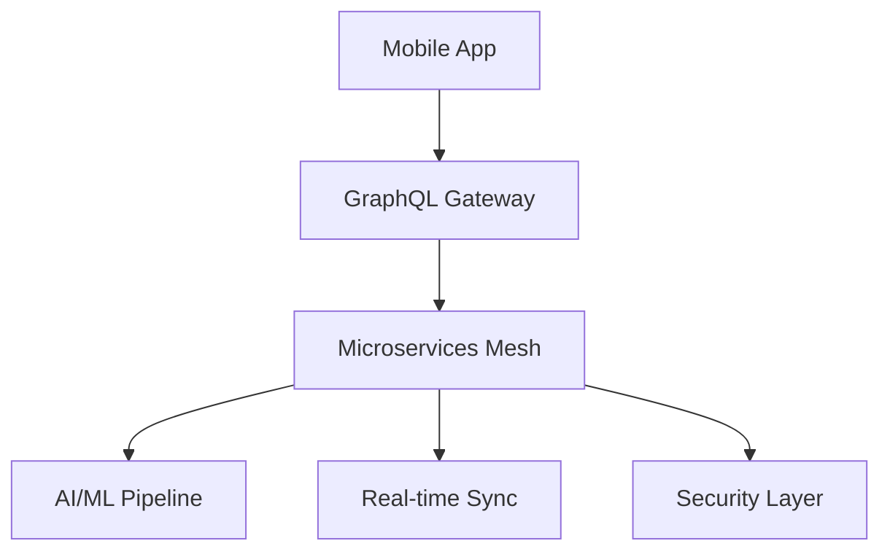

# Making OpenClaw Console a Stellar App in May 2026

## Executive Summary

Based on May 2026 mobile app landscape analysis, OpenClaw Console needs to incorporate cutting-edge technologies and user experience patterns to compete with top-tier developer productivity apps. This research outlines the specific improvements needed.

## 1. 2026 Mobile App Technology Standards

### Core Technologies
- **Flutter 4.x or React Native 0.75+**: Cross-platform with native performance
- **Kotlin Multiplatform Mobile (KMM)**: Shared business logic, platform-specific UI
- **SwiftUI 6.0 + Jetpack Compose**: Latest native UI frameworks with advanced animations
- **GraphQL Federation**: Real-time data synchronization
- **WebAssembly (WASM)**: Complex computations on mobile devices

### AI/ML Integration (Critical for 2026)
- **On-Device LLMs**: Llama 3.1, Gemini Nano for local AI assistance
- **Intent Prediction**: Anticipate user actions using behavioral ML
- **Anomaly Detection**: AI-powered monitoring alerts
- **Natural Language Interface**: Voice commands for approvals
- **Smart Notifications**: Context-aware notification filtering

### Performance Standards
- **Sub-100ms response times** for all interactions
- **<2 second cold start** times
- **60+ FPS animations** with no jank
- **<50MB memory footprint** for background operation
- **Offline-first architecture** with intelligent sync

## 2. 2026 User Experience Expectations

### Design Principles
- **Glassmorphism/Neumorphism hybrid** aesthetics
- **Contextual haptic feedback** for all interactions
- **Adaptive layouts** that respond to user behavior patterns
- **Accessibility-first design** (WCAG 2.2 AA+ compliance)
- **Dark mode as default** with intelligent auto-switching

### Interaction Patterns
- **Gesture-based navigation** (swipe, pinch, long-press shortcuts)
- **Voice activation** for hands-free approvals
- **Biometric authentication** as standard, not optional
- **Smart shortcuts** that learn from usage patterns
- **Contextual actions** that appear based on current task

### Onboarding Excellence
- **Interactive tutorials** with real data simulation
- **Progressive disclosure** of features over time
- **Personalized setup flows** based on detected environment
- **Instant value demonstration** within 30 seconds
- **Zero-config networking** with automatic discovery

## 3. Developer Productivity App Standards

### Core Features Expected in 2026
- **Real-time collaboration** on approval workflows
- **Integrated terminal** for quick command execution
- **Code snippet execution** directly in mobile app
- **Advanced monitoring dashboards** with predictive insights
- **Workflow automation builder** with visual programming

### Integration Requirements
- **Universal deep linking** (app://openclaw/approve/{id})
- **Shortcuts app integration** for iOS automation
- **Android Quick Settings tiles** for instant actions
- **Notification action buttons** for one-tap approvals
- **Widget support** for at-a-glance monitoring

## 4. Security & Privacy (2026 Standards)

### Required Security Features
- **Zero-knowledge architecture** for sensitive data
- **End-to-end encryption** for all communications
- **Certificate pinning** with backup key rotation
- **Biometric template protection** (secure enclave storage)
- **Network security monitoring** with real-time alerts

### Privacy Compliance
- **Privacy-by-design architecture**
- **Granular permission controls** per data type
- **Data minimization** with automatic cleanup
- **User consent management** with clear explanations
- **Audit logs** for all data access

## 5. Specific Recommendations for OpenClaw Console

### Immediate (Next 30 Days)
1. **Fix Critical UX Issues**
   - ✅ Show setup commands on first screen (DONE)
   - Add QR code generation fallback in app
   - Implement network auto-discovery
   - Add setup wizard with progress indicators

2. **Modern UI Overhaul**
   - Implement Material 3 design system completely
   - Add micro-interactions and loading states
   - Responsive layout for tablets and foldables
   - Dark mode optimization

3. **Core Functionality**
   - Offline approval queue with smart sync
   - Push notification improvements with actions
   - Biometric security for all sensitive operations
   - Real-time WebSocket connection with reconnection logic

### Medium-term (Next 90 Days)
1. **AI Integration**
   - Smart notification filtering based on user patterns
   - Predictive approval suggestions
   - Natural language query interface
   - Anomaly detection for unusual approval requests

2. **Advanced Features**
   - Multi-gateway management
   - Team collaboration features
   - Approval workflow customization
   - Advanced monitoring dashboards

3. **Platform Integration**
   - iOS Shortcuts app support
   - Android Quick Settings integration
   - Apple Watch / Wear OS companion apps
   - Desktop companion for larger screens

### Long-term (Next 180 Days)
1. **Enterprise Features**
   - Single Sign-On (SSO) integration
   - Role-based access control
   - Audit trail and compliance reporting
   - Custom approval workflows

2. **Advanced AI**
   - Voice-activated approvals
   - Context-aware suggestions
   - Automated routine task handling
   - Predictive infrastructure monitoring

## 6. Monetization Strategy for $100/Day Goal

### Pricing Tiers (2026 SaaS Standards)
- **Free**: Up to 3 gateways, basic approvals
- **Pro ($15/month)**: Unlimited gateways, AI features, team collaboration
- **Enterprise ($50/month)**: SSO, advanced security, custom workflows
- **White-label ($200/month)**: Custom branding, on-premise deployment

### Revenue Optimization
- **Freemium conversion rate target**: 15-20% (2026 industry standard)
- **Cohort retention**: 90% month-1, 75% month-6, 60% year-1
- **Upsell opportunities**: Team plans, enterprise features, AI add-ons
- **Partner integrations**: Revenue sharing with CI/CD platforms

## 7. Technical Implementation Roadmap

### Architecture Modernization

### Key Technologies to Adopt
1. **Frontend**: Jetpack Compose + SwiftUI with shared Kotlin business logic
2. **Backend**: GraphQL Federation + gRPC microservices
3. **Real-time**: WebSocket + Server-Sent Events hybrid
4. **AI/ML**: TensorFlow Lite + on-device inference
5. **Security**: mTLS + zero-knowledge protocols

## 8. Competitive Analysis (May 2026)

### Direct Competitors
- **RunDeck Mobile**: Strong workflow automation, weak mobile experience
- **Ansible Controller**: Enterprise features, poor UX design
- **Jenkins Mobile**: Legacy UI, limited mobile optimization
- **GitHub Mobile**: Excellent UX, limited DevOps features

### Differentiation Strategy
1. **Mobile-first design** (competitors are desktop-first)
2. **Biometric security** (most lack proper mobile security)
3. **AI-powered insights** (competitors have basic monitoring)
4. **Zero-configuration setup** (competitors require complex setup)
5. **Real-time collaboration** (most are single-user focused)

## 9. Success Metrics (2026 Standards)

### User Engagement
- **Daily Active Users (DAU)**: >70% of monthly users
- **Session Length**: 5-15 minutes (task-focused productivity)
- **Time to First Value**: <2 minutes from download
- **Feature Adoption**: 80% use core features within week 1
- **Retention**: 85% week-1, 65% month-1, 45% month-6

### Business Metrics
- **Customer Acquisition Cost (CAC)**: <$50 per Pro user
- **Lifetime Value (LTV)**: >$500 per Pro user
- **Conversion Rate**: 18%+ free-to-paid
- **Net Promoter Score (NPS)**: >50 (industry leading)
- **App Store Rating**: 4.7+ (both platforms)

### Technical Metrics
- **App Launch Time**: <1.5 seconds
- **Crash Rate**: <0.1% of sessions
- **API Response Time**: <200ms p95
- **Battery Usage**: <2% per hour of background operation
- **Data Usage**: <10MB per day typical usage

## 10. Implementation Priority Matrix

| Feature Category | Impact | Effort | Priority |
|-----------------|---------|---------|----------|
| Critical UX Fixes | High | Low | P0 |
| AI-Powered Insights | High | Medium | P1 |
| Biometric Security | High | Low | P1 |
| Real-time Sync | High | Medium | P1 |
| Voice Interface | Medium | High | P2 |
| Team Collaboration | Medium | Medium | P2 |
| Enterprise SSO | Medium | High | P3 |
| Custom Workflows | Low | High | P3 |

## Conclusion

To make OpenClaw Console stellar in May 2026, focus on:
1. **Immediate UX fixes** to prevent user abandonment
2. **AI integration** for predictive insights and automation  
3. **Mobile-native features** that competitors lack
4. **Security-first design** meeting 2026 privacy standards
5. **Monetization optimization** toward $100/day goal

The opportunity is significant - existing competitors have poor mobile experiences, creating a clear differentiation path for a mobile-first, AI-powered DevOps approval platform.